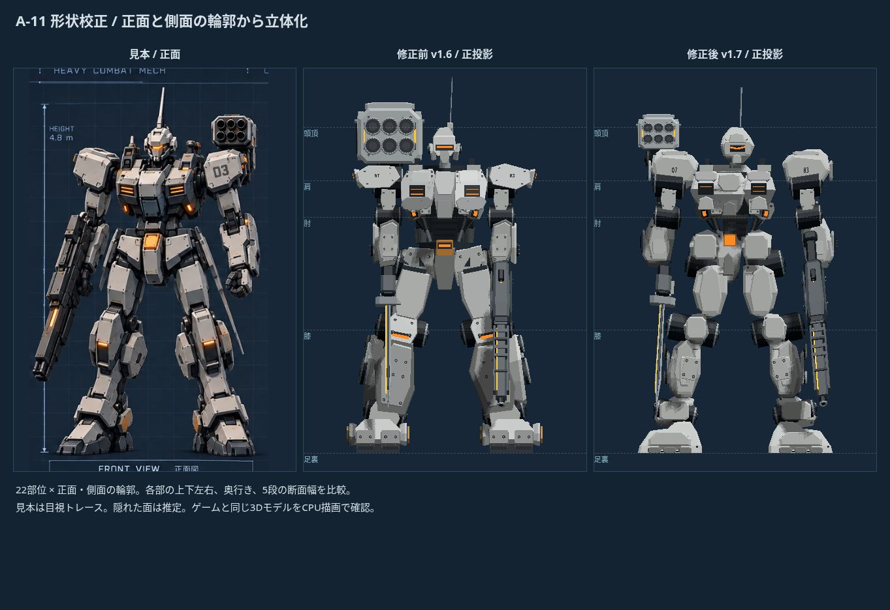
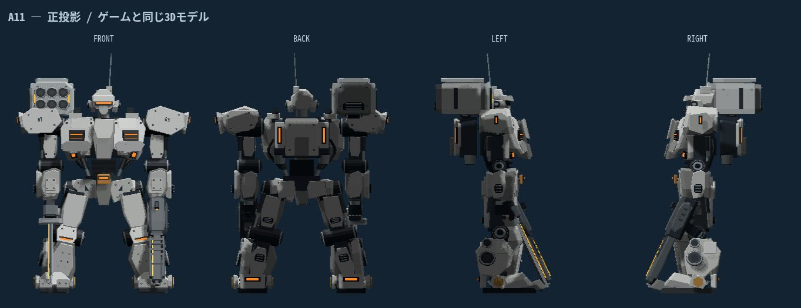
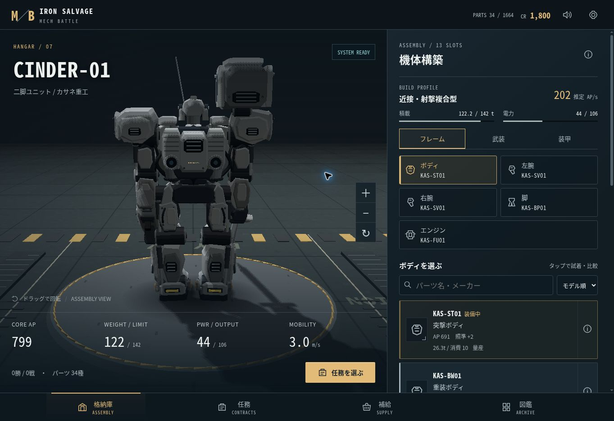
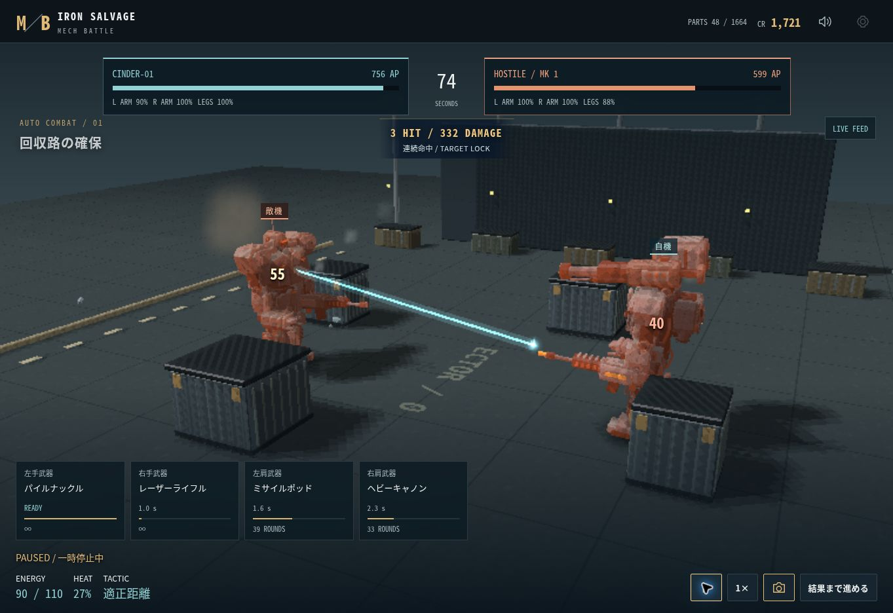
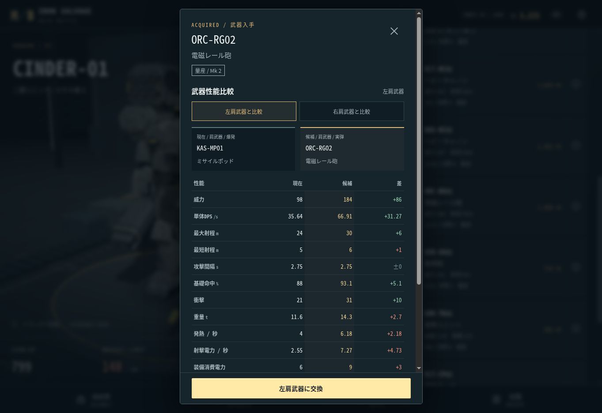

# MECH BATTLE / IRON SALVAGE

パーツを集めて機体を組み上げる、スマホ向け3Dオートバトルゲーム。

[ゲームを遊ぶ](https://mech-battle-iron-salvage.yzgame.chatgpt.site)



1.7：22部位・正面と側面の輪郭354頂点から装甲を立体化。572項目で形状を再計測し、面取り・重ね板・関節カバーを追加。[形状比較と限界](docs/shapes-v1.7.md)。

1.6：見本の頭頂〜足裏を100%として、頭の幅・高さ・奥行き、肩・胸・骨盤の幅と6か所の関節位置を計測し校正。[計測表と定義](docs/proportions-v1.6.md)。

## 1.5 の更新

- 標準二脚機を専用の輪郭・傾斜・厚みを持つモデルへ置き換え。胸・肩・前腕・太腿・膝・脛・ふくらはぎ・足首・ヘルメットにそれぞれ固有の制御点を設けた。形状は `src/reference-frame.js` で編集できる。
- 四面図と正投影の正面・背面・左右を比較して、脚の開き、足首の補正、ポッドと頭の大きさ・位置を調整。白灰色の胸の上面と暗い下部装甲、狭い腰、側面の関節ケース、長い低い足先へ変更。
- 背面のエンジンを矩形装甲と2本の縦型発光チャンネルへ変更。装甲の段差、点検面、ボルト、注意表示を追加。
- 二脚機の手持ち武器を縮小し、格納庫で下へ向ける姿勢へ変更。ライフルは黒灰色の長いカバーを持つ外観に変更。橙色のセンサーは白飛びを抑えた素材を使用。
- 重装／偵察ボディ、剛力／精密アーム、メーカー塗装、エンジン、追加装甲、各武器の交換に対応。逆関節・四脚・履帯は既存モデルを維持。戦闘ルールとセーブ形式は継承。
- この更新は参考の輪郭に近づける専用造形の試作。見本のすべての装甲形状・表面素材を再現したものではない。画面の確認はCPU描画で、WebGLの反射とiPhone実機は未検証。



## 1.4 の更新

- A-11の四面図を参考に、機体の3D形状を再調整。広い平面を残した装甲に傾斜した縁と厚い側壁を設け、白灰色の塗装と暗い骨格の境目を明確にした。
- 胸の分割面、外へ張り出した肩と側面装甲、小型ヘルメットと長いアンテナ、腰の前掛け、前腕の積層装甲、膝・脛・足首・分割した足先を作り直した。
- 肩・腕・太腿・脛の背面にも装甲と点検面を追加。エンジンの排熱口、ふくらはぎの軸、踵の発光部を維持し、回転しても機械として成立する構造にした。
- ミサイルポッドを6個の暗い発射筒と厚い箱型外装へ、ライフルを長いバレルカバーと側面装甲を持つ構造へ変更。
- 表面素材を微細な塗装の揺らぎと短い擦り傷へ変更。大きなまだら模様と強い凹凸を抑え、装甲の輪郭と面の向きを読み取りやすくした。素材と剛体メッシュの共有を継続。



## 1.3 の更新

- 武器別の戦闘演出を強化。多層のマズルフラッシュ、レーザー／レール砲の光線、散弾の弾道、斬撃の光弧、ミサイルの噴射と排煙を追加。
- 大型爆発に火球・衝撃波・火花・煙・跳ねる金属片・地面の焦げ跡を組み合わせ、WebGLでは短い局所光も追加。移動時の砂煙、ブーストの光跡、砲の反動、連続命中・部位破壊・撃破の表示を追加。
- 3つ目の低い追従カメラを追加。カメラが外周を越えたときは手前の建築物を隠し、機体の視認性を保つ。戦闘の遮蔽物は継承。
- 銃・剣・パンチ・ミサイル・砲・爆発のWeb Audioを重ねた音へ変更。左右の定位と音量圧縮に対応。
- 武器の購入前・入手直後・回収結果・交換時に、左右の手／肩を選んで現装備と比較。威力、単体DPS、最大／最短射程、攻撃間隔、基礎命中、衝撃、重量、毎秒の発熱／射撃電力、装備消費電力、弾数の12項目を数値と差で表示。
- 回収した武器には威力・DPS・射程の差を即表示。比較から回収結果に戻る、選択した部位へ交換する操作を追加。スマホでは表がスクロールしても購入・交換ボタンを常時表示。
- 粒子はWebGLで360、CPU描画で144に制限。光／煙を2つのビルボードメッシュにまとめ、爆発・光線・破片にも固定数のプールを使用。セーブ形式と戦闘ルールを継承。




## 1.2 の更新

- 機体の3D造形を作り直し。小さなセンサーヘッド、傾斜と稜線を持つ胸部、狭い腰、分割した肩・膝・脛・足先、露出した骨格で工業用メカの輪郭を強化。
- 油圧シリンダー、関節の軸とリング、曲がった配管、指、ボルト、排熱口、エンジンの背面ノズルを立体化。標準二脚機は26,688三角形、139描画単位（ブラウザ専用のマーキング・接地影を除く）。
- 二脚・逆関節・四脚・履帯をそれぞれ固有の機構に変更。履帯は転輪と分割したトレッド、四脚は4本の支持脚を持つ。ボディ・腕・追加装甲の形式も外観に反映。
- 全10武器系統に専用モデル。ライフルの機関部・弾倉・銃口、6連ミサイルの凹んだ発射筒、砲の放熱・反動機構、ブレードの稜線と発光刃を追加。弾道と発射エフェクトは各モデルの砲口から出る。
- 共通の生成装甲テクスチャを同梱し、WebGLで色・粗さ・微細な凹凸・金属反射に使用。表面素材を共有し、動かないメッシュを結合。
- 格納庫を背面へ回した際の柱による遮蔽を解消。背の高い肩武器まで収まる戦闘カメラに調整。GPUが使えない場合は戦闘中の細部を減らし、同じ構造をCPUで描画。
- ゲームの性能値・戦闘ルール・セーブ形式は継承。旧セーブをそのまま利用できます。

## 1.1 の更新

- 傾斜した装甲、積層パネル、油圧シリンダー、部位の識別マーキング、金属の反射を追加。格納庫・遮蔽物・戦場の構造を強化。
- パーツの試着で3D外観と耐久・火力・機動力・総重量・電力余裕を比較し、確定時に保存。装甲は属性軽減率も比較。
- 積載・電力・冷却・射撃消費・作戦の機体診断、所持パーツの軽量順ソートと30件ずつの表示。
- マズルフラッシュ、斬撃、弾道、ミサイルの排煙、被弾数値、爆発の衝撃波、敵味方の識別表示。武器ごとの再装填・弾切れ・過熱状態を表示。
- 武器別の発射数・命中・与ダメージと、結果に応じた改善ヒント。回収品から直接試着へ移動。
- 機体の剛体部分をまとめ、代表的な二脚機の描画単位を197から84へ削減（マーキング・接地影を除く計測）。CPU描画は深度バッファとテクスチャ対応に変更。
- 従来セーブを継承。保存破損時は直前の正常な自動バックアップから復元。

## ゲーム内容

- **1,664種類の装備**：26系統 × 8メーカー × 8モデル。メーカー別の性能の違いと5段階のレアリティ。
- **13装備スロット**：ボディ、左右の腕、脚、エンジン、胴・左右腕・脚のアーマー、左右の手武器・肩武器。
- **二脚・逆関節・四脚・履帯**：脚の形式と武装を替えると、3Dモデルと戦い方も変化。
- **10武器系統**：アサルトライフル、マシンガン、散弾砲、狙撃ライフル、振動ブレード、パイルナックル、ミサイル、キャノン、レーザー、レール砲。
- **重量・積載・電力・冷却・射程・部位耐久**が実際の戦闘へ影響。実弾・熱・爆発に対応した装甲。
- **4つの作戦と3つの部位指定**。腕の破壊で手武器が停止し、脚の破壊で機動力が低下。遮蔽物は直接射撃を遮り、誘導ミサイルは上を通過。
- **8区域・40任務・8区域ボス**。勝利でパーツを回収し、資金で装備を購入。敗北時にも一部を回収でき、修理代・装備の消失はなし。
- **倍速・一時停止・カメラ切替・戦闘結果まで進める**。倍速でも固定ステップの戦闘結果は同じ。
- **自動セーブ・3つの機体構成スロット・JSON書き出し／読み込み**。
- iPhoneの縦・横画面、safe area、ホーム画面追加、初回読み込み後のオフライン起動。全描画ライブラリを同梱し、CDN依存なし。

最初から34種類のパーツと1,800 CRを所持。格納庫で部位とパーツを選び、試着から装備を確定。「任務」から出撃してください。

## パーツ設計

パーツIDは `メーカー-系統-モデル`。カタログは決定的に生成され、重複しない1,664種類を保持します。メーカーは重量・耐久・精度・出力などのトレードオフを持ち、8モデルの装備は任務進行に合わせて回収できます。26系統のモデル構造を基に、メーカー色、装甲形式、武装、脚、推進器を組み合わせて表示します。

## 開発

Node.js 20以上。追加のnpmパッケージは不要です。

```sh
npm start
npm test
npm run build
```

開発サーバーの既定ポートは4173。ビルドは依存なしのコピー処理で、ゲームの静的ファイルをdistへ書き出します。Sitesはdistを配信。GitHub Pagesはmainブランチのルートも配信可能です。

| ファイル | 役割 |
| --- | --- |
| `src/parts.js` | カタログ、性能、スロット、任務、敵の機体 |
| `src/simulation.js` | 再現可能な固定ステップ戦闘、AI、部位破壊 |
| `src/renderer.js` | モジュール式3D機体、格納庫、戦場、アニメーション |
| `src/combat-effects.js` | 武器別の光線・爆発・粒子・破片・局所光の制限付きプール |
| `src/mech-model.js` / `src/mech-weapons.js` | モジュール式の機体と10系統の武器モデル |
| `src/mech-geometry.js` / `src/mech-surface.js` | 稜線・面取り・機械部品、共有PBR素材 |
| `src/mesh-batch.js` | 可動部を保った剛体メッシュの結合 |
| `src/build-analysis.js` / `src/ui-components.js` | 機体診断、試着と武器性能比較、武器別レポート |
| `src/software-renderer.js` / `src/software-shadow.js` | GPUが無効のブラウザ用のCPU描画と方向光の影 |
| `src/state.js` | 所持品、ショップ、報酬、セーブの検証 |
| `src/main.js` | 日本語UI、ビルド、出撃、結果、セーブ操作 |
| `src/audio.js` | Web Audioによる射撃・爆発・環境サウンド |

通常はThree.js / WebGLで描画。GPUが使えないブラウザでは、同じ構造・カメラ・アニメーションをCanvas 2Dのソフトウェア描画へ切り替えます。CPU描画では描画解像度とフレームレートを抑え、戦闘時はボルトや円形部品の分割数を減らします。光源・影・金属反射は簡略化し、深度テスト、テクスチャ、フォグ、半透明、機体の自己影に対応しています。

## 検証

カタログの一意性、全40任務の機体と決着、固定ステップの再現性、初期機体の勝率、破壊した腕と肩武器の挙動、ミサイル・レーザー、報酬の二重付与防止、敗北回収、セーブ検証、ショップの装備供給をテスト。1.1では武器別レポートの集計、試着の非破壊性と機体全体の比較、破損セーブの復元を追加し、13テストを通過。

390×844と844×390のブラウザ表示で、装備の試着・キャンセル・確定、任務、戦闘、一時停止、倍速、回収品の直接試着、再読み込み後のセーブ復元を確認。検証ブラウザはGPUが無効だったため、描画の実画面確認はCPU描画で実施。iPhone実機のWebGL描画は未検証です。

1.2では26系統の代表モデルを生成し、頂点・法線・UVの有限性と床への収まりを検証。二脚・逆関節・四脚・履帯の試着、格納庫の背面回転、390×844／844×390での新モデルの戦闘、一時停止、勝利・回収を確認。CPU描画の戦闘は検証環境で約100〜110ms／フレーム。これはiPhoneやWebGLの性能測定ではありません。

1.3では武器性能の差・有利／不利の判定、無限弾数、未装備の肩、左右の比較基準、手／肩の適合を追加し、16テストを通過。390×844と844×390で戦闘エフェクト・カメラ切替・一時停止・倍速・回収比較を確認。購入前／後の比較、選択部位への交換、回収結果への往復、比較表のスクロール、常時表示する交換ボタン、セーブ復元を実画面で確認。CPU描画は確認中に約105〜168ms／フレーム。WebGL・iPhone実機の性能測定ではありません。

1.4では装甲面の前後の向き、頂点・法線・UVの有限性、全26パーツ系統の通常／軽量モデルの床・カメラ範囲を追加し、18テストを通過。格納庫の正面・側面・背面回転、戦闘中の移動・射撃・一時停止・勝利と回収をCPU描画で確認。WebGLの金属反射とiPhone実機は未検証です。

1.5では専用装甲の傾斜面・厚み・外向きの面とモデルの有効性を検証し、19テストを通過。重装ボディの試着とキャンセル、正投影の四方向、戦闘の移動・射撃・一時停止・勝利・回収をCPU描画で確認。844×390の横画面で機体全体が収まることも確認。

## 更新時のキャッシュ

ゲームのモジュールとCSSはバージョン付きURL。Service Workerはネットワーク優先で取得し、失敗時にキャッシュへ切り替えます。リリース時には `VERSION`、モジュールのクエリ、`sw.js` のキャッシュ名とファイル一覧を同時に更新してください。セーブキーは表示キャッシュと分離しています。

## 使用ライブラリ

Three.js 0.179.1：MIT（`vendor/THREE-LICENSE.txt`）。

1.2の装甲テクスチャの制作情報は `assets/README.md` を参照。1.4の機体は `src/mech-surface.js` の共有CanvasTextureを使用し、細かい塗装の揺らぎのみを付けています。

