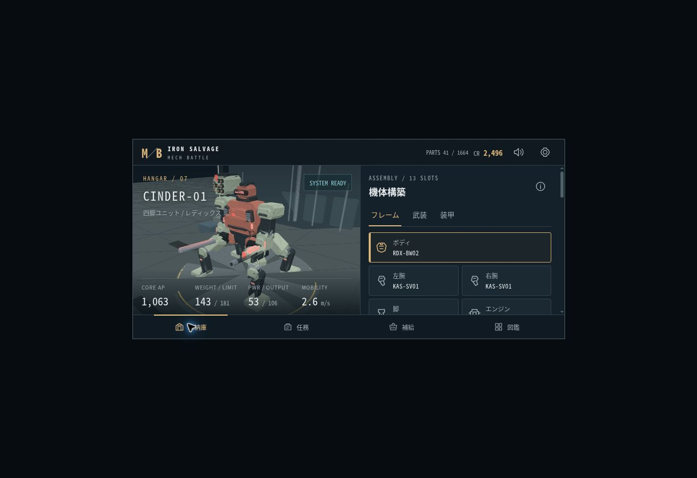

# MECH BATTLE / IRON SALVAGE

パーツを集めて機体を組み上げる、スマホ向け3Dオートバトルゲーム。

[ゲームを遊ぶ](https://mech-battle-iron-salvage.yzgame.chatgpt.site)



## ゲーム内容

- **1,664種類の装備**：26系統 × 8メーカー × 8モデル。メーカー別の性能の違いと5段階のレアリティ。
- **13装備スロット**：ボディ、左右の腕、脚、エンジン、胴・左右腕・脚のアーマー、左右の手武器・肩武器。
- **二脚・逆関節・四脚・履帯**：脚の形式と武装を替えると、3Dモデルと戦い方も変化。
- **10武器系統**：アサルトライフル、マシンガン、散弾砲、狙撃ライフル、振動ブレード、パイルナックル、ミサイル、キャノン、レーザー、レール砲。
- **重量・積載・電力・冷却・射程・部位耐久**が実際の戦闘へ影響。実弾・熱・爆発に対応した装甲。
- **4つの作戦と3つの部位指定**。腕の破壊で手武器が停止し、脚の破壊で機動力が低下。遮蔽物は直接射撃を遮り、誘導ミサイルは上を通過。
- **8区域・40任務・8区域ボス**。勝利でパーツを回収し、資金で装備を購入。敗北時にも一部を回収でき、修理代・装備の消失はなし。
- **倍速・一時停止・カメラ切替・戦闘結果まで進める**。倍速でも固定ステップの戦闘結果は同じ。
- **自動セーブ・3つの機体構成スロット・JSON書き出し／読み込み**。
- iPhoneの縦・横画面、safe area、ホーム画面追加、初回読み込み後のオフライン起動。全描画ライブラリを同梱し、CDN依存なし。

最初から34種類のパーツと1,800 CRを所持。格納庫で部位とパーツを選び、「任務」から出撃してください。

## パーツ設計

パーツIDは `メーカー-系統-モデル`。カタログは決定的に生成され、重複しない1,664種類を保持します。メーカーは重量・耐久・精度・出力などのトレードオフを持ち、8モデルの装備は任務進行に合わせて回収できます。26系統のモデル構造を基に、メーカー色、装甲形式、武装、脚、推進器を組み合わせて表示します。

## 開発

Node.js 20以上。追加のnpmパッケージは不要です。

```sh
npm start
npm test
npm run build
```

開発サーバーの既定ポートは4173。ビルドは依存なしのコピー処理で、ゲームの静的ファイルをdistへ書き出します。Sitesはdistを配信。GitHub Pagesはmainブランチのルートも配信可能です。

| ファイル | 役割 |
| --- | --- |
| `src/parts.js` | カタログ、性能、スロット、任務、敵の機体 |
| `src/simulation.js` | 再現可能な固定ステップ戦闘、AI、部位破壊 |
| `src/renderer.js` | モジュール式3D機体、格納庫、戦場、アニメーション |
| `src/software-renderer.js` | GPUが無効のブラウザ用のCPU描画 |
| `src/state.js` | 所持品、ショップ、報酬、セーブの検証 |
| `src/main.js` | 日本語UI、ビルド、出撃、結果、セーブ操作 |
| `src/audio.js` | Web Audioによる射撃・爆発・環境サウンド |

通常はThree.js / WebGLで描画。GPUが使えないブラウザでは、同じ形状・カメラ・アニメーションをCanvas 2Dのソフトウェア描画へ切り替えます。CPU描画では影とテクスチャの表現を簡略化します。

## 検証

カタログの一意性、全40任務の機体と決着、固定ステップの再現性、初期機体の勝率、破壊した腕と肩武器の挙動、ミサイル・レーザー、報酬の二重付与防止、敗北回収、セーブ検証、ショップの装備供給をテスト。

390×844と844×390のブラウザ表示で、装備の変更、任務、戦闘、一時停止、回収、購入、図鑑検索、再読み込み後のセーブ復元を確認。検証ブラウザはGPUが無効だったため、描画の実画面確認はCPU描画で実施。iPhone実機のWebGL描画は未検証です。

## 更新時のキャッシュ

ゲームのモジュールとCSSはバージョン付きURL。Service Workerはネットワーク優先で取得し、失敗時にキャッシュへ切り替えます。リリース時には `VERSION`、モジュールのクエリ、`sw.js` のキャッシュ名とファイル一覧を同時に更新してください。セーブキーは表示キャッシュと分離しています。

## 使用ライブラリ

Three.js 0.179.1：MIT（`vendor/THREE-LICENSE.txt`）。

