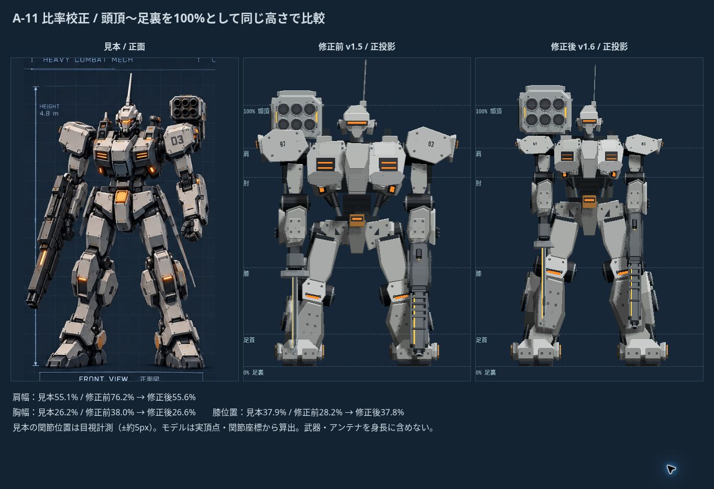

# A‑11 比率校正 v1.6

基準：参考画像の正面図、頭頂 y=155〜足裏 y=728（573px）を100%。アンテナ・武器は身長と肩幅に含めない。

幅は各装甲の左右端、高さは足裏から関節中心まで。参考画像は目視計測で、隠れた関節には約5〜10pxの不確かさがある。モデルは標準初期装備の実頂点と関節座標を正投影で計測。重装・偵察の幅変更は維持。

| 指標 | 見本 | 修正前 | 修正後 |
|---|---:|---:|---:|
| 頭幅 | 10.5% | 15.1% | 10.5% |
| 頭の高さ | 11.2% | 12.5% | 11.2% |
| 頭の奥行き（側面） | 12.4% | 14.4% | 12.4% |
| 肩幅 | 55.1% | 76.2% | 55.6% |
| 胸幅 | 26.2% | 38.0% | 26.6% |
| 骨盤幅 | 25.1% | 28.3% | 25.9% |
| 肩の高さ | 83.6% | 81.5% | 83.1% |
| 肘の高さ | 72.4% | 62.4% | 72.5% |
| 手首の高さ | 55.0% | 43.2% | 55.1% |
| 股関節の高さ | 57.6% | 50.5% | 57.5% |
| 膝の高さ | 37.9% | 28.2% | 37.8% |
| 足首の高さ | 12.4% | 5.8% | 12.5% |

肩幅を含む横方向、胸の高さ、頭の大きさを個別に変更。腕・脚は肩→肘→手首、股関節→膝→足首→足を区分して校正し、武器と足の形状を保つ。武器の照準・反動・マズル、パーツ交換、既存セーブ形式は維持。

`node scripts/measure-a11.mjs docs/a11-proportions-v1.6.json` で再計測できる。数値の一致は全形状・材質の一致を意味しない。側面の厚みや装甲の細部にはまだ差がある。

