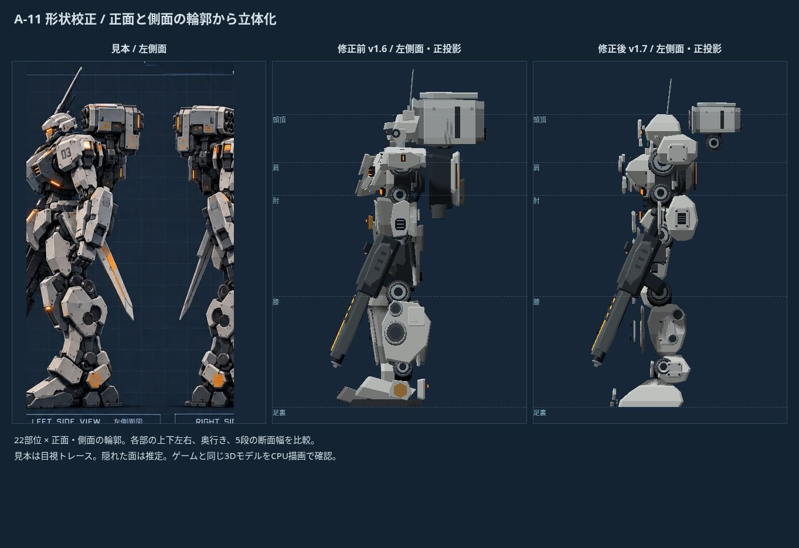

# A‑11 形状校正 v1.7

前回の12項目の比率計測に加え、22部位の正面・側面輪郭を354頂点で手動トレース。上下左右・前後の境界6項目と、各投影5段の断面の両端20項目、合計572項目を比較します。

## 測り方と限界

見本の頭頂155px、足裏728px、全高573pxを基準に位置を登録。側面は部位ごとに上下を正面へ登録します。左部位は右部位の反転と実測オフセットを使い、背部と隠れた縁は推定です。可視輪郭でも約5〜10pxの読み取り誤差があります。

計測対象は装甲のメッシュの実頂点・三角形断面です。重ね板、ボルト、関節カバーも含み、アンテナと透明デカールは除外。武器、ミサイルポッド、動作姿勢、ライティング、表面仕上げはこの572項目に含みません。画像の類似度や再現率ではありません。

修正前はv1.6校正済み形状、修正後はv1.7。同じ標準装備・白灰色塗装で比較。参考画像に遠近や左右差があり、QAは正投影なので完全には重なりません。スクリーンショットはゲームと同じモデルのCPU描画で、GPU/PBRの画質比較ではありません。

## 結果

部位ごとの平均を集計すると、境界位置の平均差は **16.7 → 2.7px**、断面両端の平均差は **22.1 → 5.4px**。修正前には対象の高さに装甲がなく計測できない断面が20か所あり、修正後は0か所。断面平均では未計測を除外しているため、比較範囲が完全に同一ではありません。

| 部位 | 境界差 前→後(px) | 断面差 前→後(px) | 前の未計測断面 |
|---|---:|---:|---:|
| 頭部 | 2.0 → 2.3 | 6.2 → 5.5 | 0 |
| 左肩 | 18.3 → 3.4 | 20.4 → 4.2 | 4 |
| 右肩 | 14.6 → 3.4 | 21.2 → 4.9 | 2 |
| 左胸 | 5.1 → 1.4 | 9.4 → 5.1 | 0 |
| 右胸 | 3.3 → 1.3 | 8.6 → 5.3 | 0 |
| 胸部中央 | 17.0 → 2.2 | 26.8 → 5.0 | 0 |
| 左前腕 | 27.1 → 3.4 | 39.6 → 6.0 | 0 |
| 右前腕 | 30.6 → 3.4 | 43.0 → 6.0 | 0 |
| 左大腿 | 14.7 → 2.6 | 18.9 → 4.8 | 0 |
| 右大腿 | 15.3 → 2.6 | 18.5 → 4.8 | 0 |
| 左膝 | 11.6 → 2.4 | 16.8 → 4.5 | 0 |
| 右膝 | 11.7 → 2.4 | 16.6 → 4.3 | 0 |
| 左脛 | 21.0 → 3.7 | 22.1 → 7.2 | 0 |
| 右脛 | 23.3 → 3.7 | 23.4 → 7.2 | 0 |
| 左足首 | 23.2 → 2.8 | 29.4 → 5.5 | 0 |
| 右足首 | 23.0 → 2.8 | 27.4 → 4.1 | 2 |
| 左足 | 9.9 → 2.5 | 23.8 → 8.8 | 0 |
| 右足 | 9.9 → 2.5 | 23.8 → 6.6 | 0 |
| 左腰装甲 | 17.7 → 2.6 | 16.6 → 6.7 | 6 |
| 右腰装甲 | 18.1 → 2.6 | 17.4 → 6.7 | 4 |
| 骨盤 | 19.5 → 2.4 | 21.9 → 2.4 | 2 |
| 背部 | 30.4 → 3.7 | 34.1 → 3.0 | 0 |

## 実装

正面と側面の断面を組み合わせた閉じた装甲体に変更。肩の張り出し、前腕の外開き、腰装甲の分割、大腿と脛の傾斜、長い足先と側面の奥行きを反映。さらに面取りと独立した装甲板、継ぎ目、ボルト、側面整備パネル、脛の二重関節カバーを追加。ミサイルポッドは小型化して外側へ移動しました。

関節軸の円形を保ち、装甲の非均一スケールと回転の下でも細部の座標を保つよう修正。CPU描画は斜面の自己影のノイズを軽減するバイアスを追加。元のWebGL描画と戦闘・比較UIは維持。

再計測: `node scripts/measure-a11-shapes.mjs docs/a11-shapes-v1.7.json`。全数値はJSONに保存。頭部の境界誤差はわずかに増えており、足先と脛の細部・表面の情報密度には引き続き差があります。AAA作品と同等の完成度に達したという評価ではありません。

検証: 自動テスト21件、26系統×通常/軽量描画の有限座標と床・カメラ範囲、装甲の閉じた正向き体積、変換後の細部の位置を確認。ブラウザーで格納庫、武器試着比較、戦闘の射撃・一時停止・終了と回収品を確認。iPhone実機およびGPU描画の画質・フレームレートは未検証。
